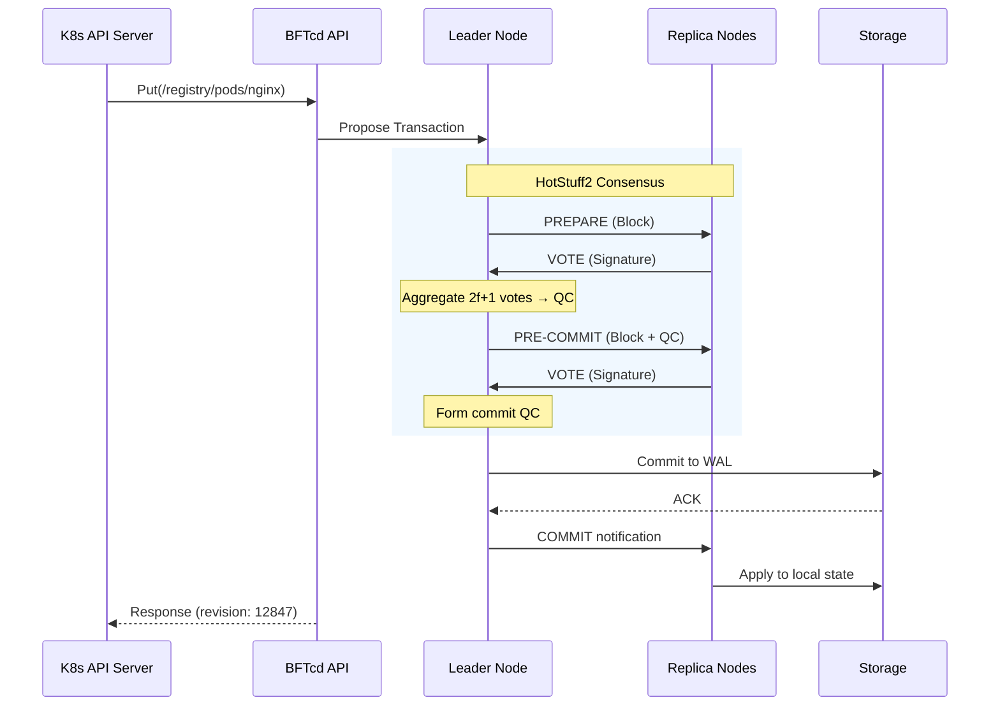
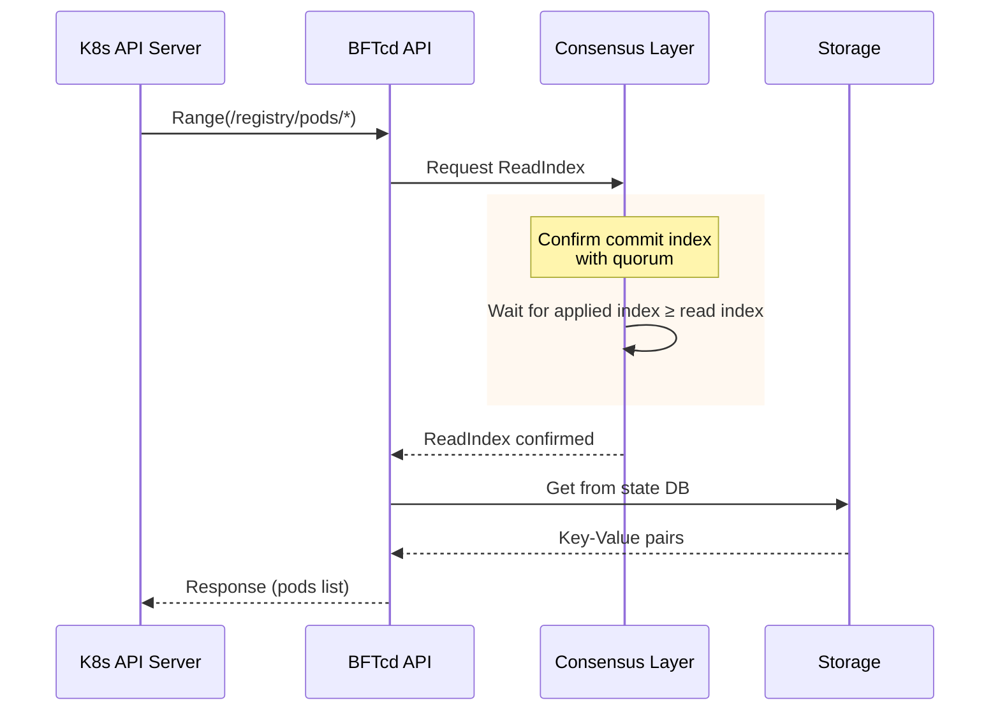
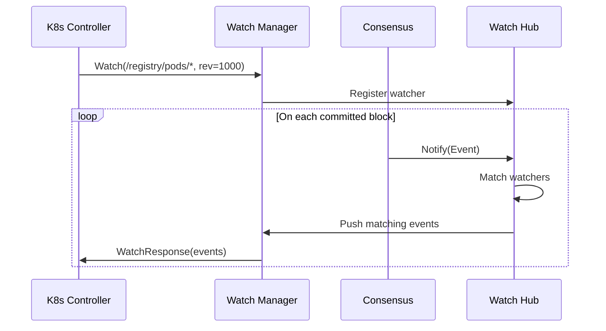
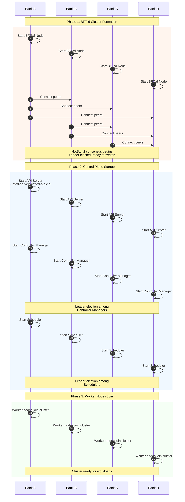
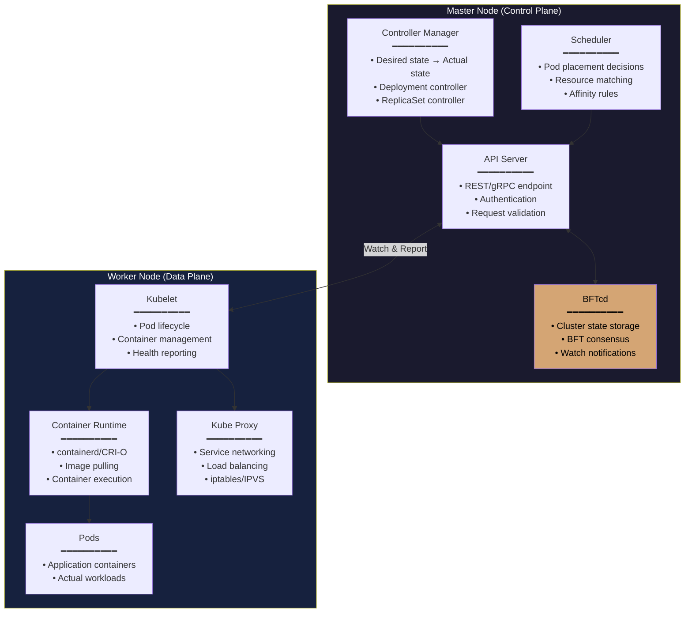
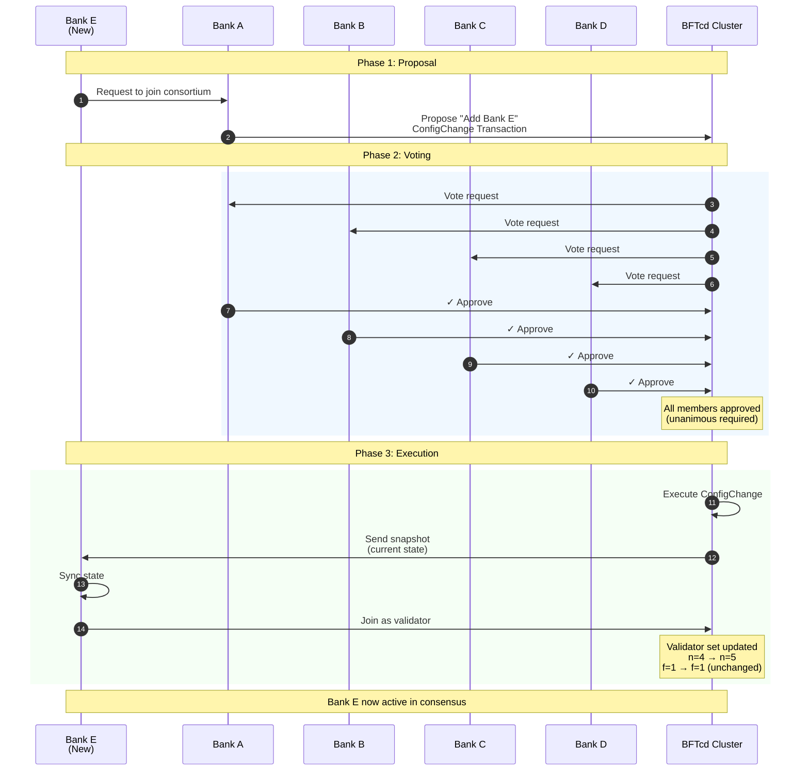

# BFTcd: 탈중앙 금융 인프라를 위한 비잔틴 장애 허용 분산 저장소(etcd alternative with HotStuff2 BFT consensus for trustless environments)

## Whitepaper v0.1

---

# Executive Summary

2025년 12월 기준, 글로벌 디지털 자산 시장은 단순한 가치 저장을 넘어 '통합 원장(Unified Ledger)'과 '예금 토큰(Deposit Token)'을 통한 기관 간 결제의 시대로 진입했다. 프로젝트 아고라(Project Agorá)와 같은 이니셔티브는 상호 신뢰하지 않는 다수의 금융 기관이 단일 인프라를 공유할 것을 요구한다. 그러나 현재의 사실상 표준인 Kubernetes 기반 인프라는 치명적인 불일치를 안고 있다. 애플리케이션 계층은 BFT를 지향하나, 인프라의 상태를 저장하는 핵심 엔진인 etcd는 여전히 CFT(Crash Fault Tolerance)인 Raft 알고리즘에 의존한다. 본 문서는 이러한 인프라단(저장소)에서의 비잔틴 문제를 해결하기 위해, HotStuff 2.0 합의 알고리즘을 적용한 새로운 상태 저장소 BFTcd를 제안한다. 이는 금융 즉 은행 컨소시엄 인프라에 수학적으로 증명 가능한 무결성과 안전성을 제공한다.

---

# 1. 시장 배경
2025년 상반기 지니어스법안의 진행으로 스테이블코인의 전통금융권으로의 흐름은 확실시 되었다. 현재의 금융은 전통 금융의 온체인 전환 이라는 거대한 메가 웨이브를 맞이하고 있다.

## 1.1 스테이블코인 시장 구조적 성숙과 한계 
2024년 비트코인 현물 ETF 승인 이후, 암호화폐 시장은 제도권 편입의 급물살을 탔으며, 그 중심에는 스테이블코인이 있다. 2025년 12월 기준, 글로벌 스테이블코인 시가총액은 **2,800억 달러(약 370조 원)** 를 상회하며, 이는 웬만한 국가의 통화량(M1)을 넘어서는 규모라고 할 수 있다.
- **결제 레일(Payment Rail)로서의 진화**: 과거 트레이딩의 기축 통화 역할에 머물렀던 스테이블코인은 이제 국경 간 송금(Cross-border Payment), B2B 정산, 심지어 일부 국가의 소매 결제 수단으로 자리 잡았다. 유럽의 **MICA(암호자산시장법)** 전면 시행은 이러한 사용성에 법적 확실성을 부여했다.
- **민간 화폐의 내재적 리스크**: 그러나 Tether(USDT)나 Circle(USDC)과 같은 민간 스테이블코인은 본질적으로 **상업 은행 예금(Commercial Bank Money)과 구별되는 '그림자 금융(Shadow Banking)'의 성격**을 띤다. 이들은 100% 지급준비금을 주장하지만, 실시간 회계 감사의 부재와 자금 운용의 불투명성은 여전히 시스템 리스크(Systemic Risk)로 남아 있다.
- **유동성 파편화(Liquidity Fragmentation)**: 다양한 블록체인 네트워크(Ethereum, Solana, L2s)에 흩어진 스테이블코인은 자본 효율성을 떨어뜨린다. 금융 당국과 글로벌 은행들은 이러한 파편화된 유동성을 통합하고, **중앙은행 화폐(Central Bank Money)와의 완전한 교환성(Singleness of Money)** 을 보장할 수 있는 새로운 대안을 모색하게 되었다.

## 1.2 은행 주도 예금 토큰의 등장 (The Rise of Bank-Led Deposit Tokens)
민간 스테이블코인의 한계를 극복하기 위해 등장한 것이 바로 **예금 토큰(Deposit Token)** 이다. 이는 상업 은행이 자신의 대차대조표상 부채(Liability)인 예금을 블록체인상에 토큰화하여 발행하는 형태다.

- **규제 정합성과 안정성**: 예금 토큰은 기존 예금자 보호 제도의 적용을 받으며, 중앙은행의 지급준비금 제도 안에서 운용된다. 이는 민간 스테이블코인이 가질 수 없는 **'무위험(Risk-free)'** 에 가까운 신뢰를 제공한다.

- **프로젝트 아고라(Project Agorá)와 통합 원장**: 2024년 BIS(국제결제은행)가 발표하고 2025년 본격화된 프로젝트 아고라는 7개국 중앙은행과 민간 금융기관이 참여하여, **도매용 CBDC(Wholesale CBDC)** 와 토큰화된 예금을 하나의 **'통합 원장(Unified Ledger)'** 위에서 구동한다.

- **원자적 결제(Atomic Settlement)의 실현**: 기존 스위프트(SWIFT) 망이 메시지 전송과 자금 이산이 분리되어 있어 2~3일의 정산 시간이 소요되었던 반면, 예금 토큰 시스템은 **PvP(Payment vs Payment)** 및 **DvP(Delivery vs Payment)** 방식을 통해 즉각적인 동시 결제를 가능케 한다. 이는 JP Morgan의 JPM Coin이 일일 120억 달러 거래량을 처리하며 실증하고 있다.

## 1.3 연합 은행들의 컨소시엄 등장 및 가능성 그리고 문제 

예금 토큰과 통합 원장의 등장은 금융 인프라 아키텍처에 있어 **'단일 중앙 집중형 원장'에서 '다자간 분산 원장(DLT)'으로의 이동**을 강제한다. 이 변화는 선택이 아닌 기술적, 경제적 필연이라고 생각한다. 

- **상호 운용성(Interoperability)을 위한 공유 장부** : A은행의 예금 토큰이 B은행으로 이체되기 위해서는 두 은행이 상태(State)를 공유하는 단일 네트워크상에 존재해야 한다. 이는 특정 은행이 독점하는 Private DB로는 불가능하며, 다수의 은행이 노드로 참여하는 **컨소시엄 블록체인** 형태여야만 한다.

- **신뢰 구조(Trust Architecture)의 재편** : 경쟁 관계에 있는 은행들은 서로를 완전히 신뢰하지 않는다(Mutual Mistrust). 따라서 거래의 유효성을 검증하는 권한은 특정 주체에게 독점될 수 없으며, 합의 알고리즘을 통해 분산되어야 한다. 이 시점에서 **'무신뢰 환경(Trustless Environment)'** 을 전제로 한 인프라 설계가 요구된다.

- **규제 당국의 감시 요구** : 금융 안정 위원회(FSB)와 각국 규제 기관은 시스템적 중요성을 가진 인프라에 대해 **단일 실패 지점(Single Point of Failure) 제거** 를 요구한다. 이는 물리적으로나 논리적으로 분산된 노드들이 협력하여 시스템을 유지하는 **Kubernetes 기반의 클러스터링 환경**을 사실상의 표준(De Facto Standard)으로 만들었다.

**결론적으로, 스테이블 코인이 대한민국의 금융권으로의 인프라화가 되려면 은행들간의 연합 컨소시엄이 필요하다고 생각하고 이는 즉슨 '은행들의 연합체(Consortium)'가 운영하는 거대한 분산 컴퓨터 위에서 작동한다.** 그러나 현재 등장한 Hyperledger 계열 등은 애플리케이션 계층에서만 BFT(비잔틴 장애 허용)를 달성했을 뿐, 그 하부의 **인프라 조정 계층(Infrastructure Orchestration Layer)** 은 여전히 과거의 신뢰 모델(CFT)에 머물러 있다. 이것이 바로 내가 **BFTcd**를 제안하는 이유다.

---

# 2. 문제 정의: 컨소시엄 그 자체의 인프라에서의 취약점

## 2.1 컨소시엄 블록체인의 현재 구조

은행 컨소시엄이 구축하는 블록체인 인프라는 일반적으로 다음과 같은 계층으로 구성된다:

## 2.2 계층 간 보안 수준의 불일치

위 구조에서 심각한 문제가 드러난다:

| 계층 | 장애 허용 수준 | 악의적 노드 방어 |
|------|---------------|-----------------|
| 블록체인 | **BFT** | 가능 |
| Kubernetes Control Plane | **CFT** | 불가 |
| etcd | **CFT** | 불가 |

**블록체인 계층은 BFT를 지원**하여 참여 은행 중 일부가 악의적으로 행동해도 시스템이 정상 동작한다. 그러나 **이를 운영하는 인프라 계층은 여전히 CFT 수준**에 머물러 있다.

## 2.3 CFT와 BFT의 본질적 차이

**Crash Fault Tolerant (CFT) - 현재 etcd의 Raft**

기본 가정:
- 노드는 정상 동작하거나 완전히 멈춤 (crash)
- 악의적 행동은 발생하지 않음
- 모든 노드는 신뢰할 수 있음

적합한 환경:
- 단일 조직이 모든 노드를 운영
- 내부 네트워크, 물리적 보안 확보
- 공격자가 노드를 장악할 가능성 없음

**Byzantine Fault Tolerant (BFT) - BFTcd의 목표**

기본 가정:
- 노드가 임의의 방식으로 오작동 가능
- 악의적 노드가 거짓 정보 전파 가능
- 노드 간 공모 가능성 존재

적합한 환경:
- 다수 조직이 각자의 노드를 운영
- 조직 간 완전한 신뢰 없음
- 경제적 이해관계 충돌 가능

## 2.4 은행 컨소시엄에서의 위협 시나리오

은행 컨소시엄 환경에서 CFT 기반 etcd는 다음과 같은 공격에 취약하다:

**시나리오 1: 악의적 상태 조작**

Bank A가 운영하는 etcd 노드가 악의적으로:
- 특정 Pod의 배포 상태를 조작
- 경쟁 은행의 서비스 설정을 변경
- 리소스 할당 정보를 왜곡

CFT 시스템은 이를 "정상적인 업데이트"로 인식하고 전파한다.

**시나리오 2: 이중 메시지 (Equivocation)**

악의적 노드가 서로 다른 노드에게 다른 정보를 전송:
- Node A에게: "Pod X는 Bank B에 배포됨"
- Node B에게: "Pod X는 Bank C에 배포됨"

이로 인해 클러스터 상태의 불일치가 발생한다.

**시나리오 3: 선택적 서비스 거부**

악의적 노드가 특정 은행의 요청만 지연 또는 거부:
- 경쟁 은행의 스케일링 요청 무시
- 특정 시간대에 결제 서비스 장애 유발

## 2.5 현재 대응책의 한계

**"블록체인이 BFT니까 괜찮다"는 착각**

블록체인 계층의 BFT는 **원장 데이터의 무결성**만 보장한다. 그러나:
- 블록체인 노드의 배포/삭제는 K8s가 담당
- 설정 변경, 버전 업그레이드도 K8s 영역
- K8s가 손상되면 블록체인 노드 자체가 위험

**"etcd 앞에 방화벽을 두면 된다"는 착각**

외부 공격은 막을 수 있지만:
- 컨소시엄 내부 은행이 운영하는 노드는 "내부자" 임
- 방화벽은 내부자 공격에 무력함
- 합의 참여자 자체가 악의적일 수 있음

---

# 3. 솔루션: BFTcd

## 3.1 핵심 아이디어

BFTcd는 etcd의 합의 계층을 **Raft에서 HotStuff2로 교체**하여, 컨소시엄 환경에 적합한 Byzantine Fault Tolerance를 제공한다.

## 3.2 설계 원칙

**원칙 1: 완벽한 etcd 호환성**

- 기존 Kubernetes 무수정 연동
- etcdctl 등 기존 도구 그대로 사용
- 마이그레이션 비용 최소화

**원칙 2: 입증된 합의 알고리즘**

- HotStuff2: Meta(구 Facebook)의 Diem/Libra에서 검증
- 학술적으로 안전성 증명 완료
- 선형 메시지 복잡도로 확장성 확보

**원칙 3: 암호학적 검증 가능성**

- 모든 상태 변경에 서명 포함
- 제3자가 감사 가능한 불변 로그
- 규제 기관 요구사항 충족

**원칙 4: 운영 현실성**

- 기존 인프라 팀의 역량으로 운영 가능
- 표준적인 모니터링/알림 체계 지원
- 점진적 마이그레이션 경로 제공

## 3.3 HotStuff2 선택 이유

BFT 합의 알고리즘은 다양하나, HotStuff2를 선택한 이유:

| 특성 | PBFT | Tendermint | HotStuff2 |
|------|------|------------|-----------|
| 메시지 복잡도 | O(n²) | O(n²) | **O(n)** |
| 합의 라운드 | 3 | 3 | **2** |
| 리더 교체 비용 | 높음 | 중간 | **낮음** |
| 파이프라이닝 | 불가 | 불가 | **가능** |
| 프로덕션 검증 | 가능 | 가능 |  (Diem) |

**선형 복잡도**의 의미:
- 4개 은행 → 7개 은행으로 확장 시
- PBFT: 통신량 3배 이상 증가
- HotStuff2: 통신량 약 1.75배 증가

**하지만 Go 구현체가 없어서 Rust 로 된 **HotStuff2**를 Go로 바꾸어야하는 비용이 듬
## 3.4 BFTcd의 보안 보장

**Safety (안전성)**

"모든 정직한 노드는 동일한 순서로 동일한 상태 변경을 적용한다"

- 악의적 노드가 f개 있어도 (n ≥ 3f+1)
- 정직한 노드들은 절대로 서로 다른 상태를 갖지 않음
- 암호학적 서명으로 검증 가능

**Liveness (활성)**

"정직한 리더가 있으면 시스템은 반드시 진행한다"

- 악의적 리더는 타임아웃으로 교체
- 최대 f+1번의 리더 교체로 정직한 리더 보장
- 일시적 네트워크 장애에서도 복구

**Accountability (책임 추적성)**

"악의적 행동은 암호학적으로 증명 가능하다"

- 이중 서명 시 증거 생성
- 규칙 위반 노드 식별 가능
- 거버넌스 차원의 제재 근거 제공

---

# 4. 기술 아키텍처

## 4.1 시스템 계층 구조

BFTcd는 네 개의 명확히 분리된 계층으로 구성된다:

## 4.2 합의 프로세스 개요

HotStuff2의 합의는 다음과 같이 진행된다:

**정상 경로 (Happy Path)**

**리더 장애 시 (View Change)**

## 4.3 Quorum Certificate (QC)

QC는 BFTcd의 핵심 암호학적 구조이다:

검증 방법:
1. 서명자 수가 2f+1 이상인지 확인
2. 집계 서명이 유효한지 BLS 검증
3. 서명자들이 현재 검증자 집합에 포함되는지 확인

→ 이 세 조건을 만족하면 해당 블록은 "합의됨"

## 4.4 노드 구성

각 참여 은행은 하나 이상의 BFTcd 노드를 운영한다:

## 4.5 네트워크 토폴로지

컨소시엄 노드들은 Full Mesh 토폴로지로 연결된다:

연결 특성:

• 모든 노드 쌍 간 직접 연결 (Full Mesh)

• mTLS로 암호화 및 상호 인증

• 지리적 분산으로 단일 장애점 제거

## 4.6 데이터 흐름

**쓰기 요청 처리**

**읽기 요청 처리**

**이벤트 읽었을 때 처리**

---

## 4.7 부트스트랩 순서

## 4.8 노드들 관계

# 5. 은행 컨소시엄 통합 아키텍처

## 5.1 전체 시스템 구성

## 5.2 계층별 책임과 보호

| 계층 | 책임 | 보호 대상 | 합의 |
|------|------|----------|------|
| **Application** | 비즈니스 로직 | 사용자 요청 처리 | - |
| **Blockchain** | 원장 무결성 | 토큰 잔액, 거래 내역 | **BFT (QBFT)** |
| **Kubernetes** | 워크로드 관리 | 배포, 스케일링, 복구 | HA (리더 선출) |
| **BFTcd** | 클러스터 상태 | Pod, Service, Config | **BFT (HotStuff2)** |

## 5.3 보안 경계

## 5.4 장애 시나리오 대응

**시나리오: Bank A 노드의 악의적 행동**

상황: Bank A가 운영하는 BFTcd 노드가 
      잘못된 Pod 배포 정보를 전파 시도

# 6. 거버넌스 모델

## 6.1 컨소시엄 거버넌스 구조

BFTcd는 기술적 합의뿐 아니라 조직적 거버넌스도 지원한다(이 쿠버 컨소시엄에 합류하는걸 말함):

## 6.2 멤버십 변경 프로세스

**새 은행 추가**

# 7. 성능 및 확장성

## 7.1 성능 특성

**예상 성능 지표**

| 구성 | 지연 시간 (쓰기) | 처리량 |
|------|-----------------|--------|
| 4 노드, 단일 리전 | ~50ms | ~15,000 ops/s |
| 7 노드, 다중 리전 | ~150ms | ~8,000 ops/s |
| 10 노드, 글로벌 | ~250ms | ~5,000 ops/s |

## 7.2 확장 전략

**수직 확장 (Vertical)**
- 더 강력한 하드웨어
- SSD/NVMe 스토리지
- 네트워크 대역폭 증가

**수평 확장 (Horizontal)**
- 읽기 전용 복제본 추가
- 지역별 캐시 노드
- 샤딩 (향후 로드맵)
---

# 8. 기존 솔루션 비교

## 8.1 경쟁 솔루션 분석

| 솔루션 | BFT 지원 | K8s 호환 | 프로덕션 준비 | 은행 적합성 |
|--------|---------|----------|--------------|-------------|
| **etcd (Raft)** | X | 완벽 |  매우 성숙 | CFT만 |
| **CockroachDB** | X | 부분 | 성숙 | CFT만 |
| **Tendermint** | O | X | 성숙 | K8s 비호환 |
| **Cosmos SDK** | O | X | 성숙 | K8s 비호환 |
| **BFTcd** | O | 완벽 | 개발중 | 최적 |

## 8.2 왜 기존 솔루션으로는 안 되는가

**"Tendermint를 쓰면 되지 않나?"**

Tendermint는 훌륭한 BFT 엔진이지만:
- etcd API와 호환되지 않음
- K8s는 etcd API에 강하게 결합됨
- K8s를 수정하려면 막대한 비용 발생

**"etcd를 신뢰할 수 있는 환경에만 두면?"**

물리적 격리는 가능하지만:
- 컨소시엄의 핵심 가치인 "탈중앙화"를 포기
- 결국 누군가 etcd를 독점 운영
- 다른 은행들이 해당 은행을 신뢰해야 함

**"블록체인이 BFT니까 충분하지 않나?"**

블록체인 BFT는 원장만 보호:
- 블록체인 노드의 배포는 K8s가 담당
- K8s 상태가 조작되면 블록체인 노드도 위험
- 인프라 계층의 무결성이 선행 조건

---
# 9. 결론

## 9.1 핵심 가치 제안

BFTcd는 단순한 기술 교체가 아니라, **디지털 금융 인프라의 신뢰 기반을 완성**하는 솔루션이다.

## 9.2 시장 기회

- **스테이블코인 시장**: 1,500억+ 달러, 연 성장률 20%+
- **예금 토큰 시장**: 주요 은행들의 파일럿 본격화
- **규제 환경**: 컨소시엄 기반 솔루션 선호

## 9.3 차별화 요소

1. **유일한 BFT + etcd 호환 솔루션**
2. **K8s 무수정 연동**
3. **HotStuff2의 입증된 안전성**
4. **은행 컨소시엄 특화 거버넌스**

---

**문서 버전**: 0.1 
**최종 수정**: 2025년 12월 15일  

---

*본 백서는 BFTcd 프로젝트의 비전과 기술적 방향을 설명합니다. 세부 구현 사항은 개발 과정에서 변경될 수 있습니다.*
